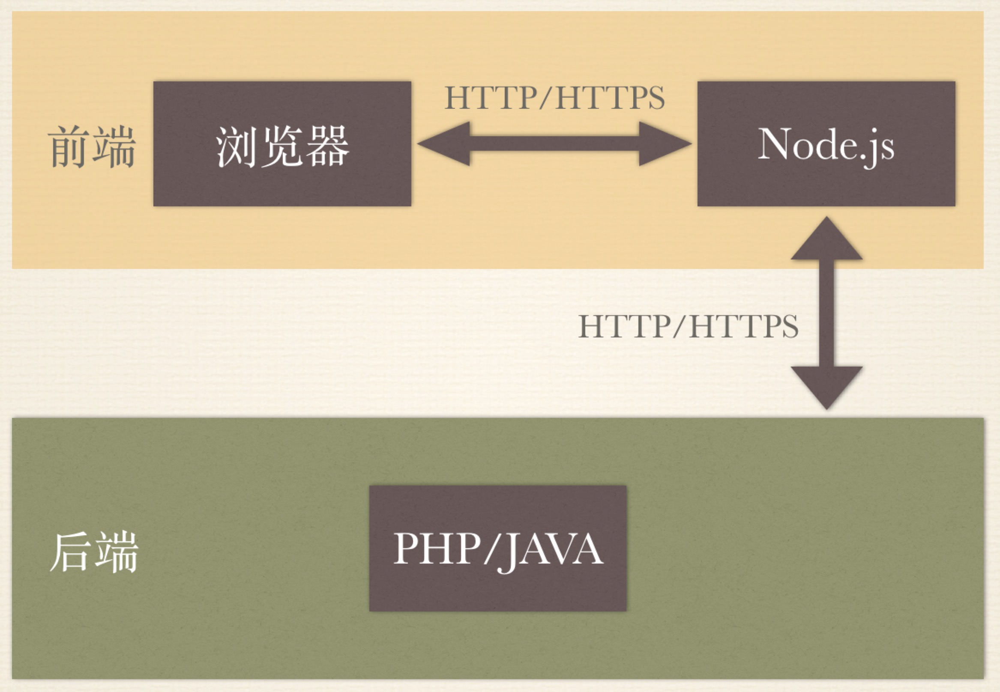

# 前言
话说，天下大势，合久必分，分久必合。今天咱们就来看看，“前端”这个角色，在编程界，与“后端”的分分合合。

# 前端的起源
说到前端，最容易想到的，自然就是 —— “HTML”。那么，“HTML”是怎么来的呢？

> 1980年，物理学家蒂姆· 伯纳斯· 李在欧洲核子研究中心承包工程期间，为使研究人员使用并共享文档（document），提出了最初的HTML。

原来是个包工头发明的。

可以看得出，从1980年到现在，一路走来，HTML 一直保持着初心 —— “document”。因为至今，`document` 仍然是浏览器脚本中，重要的一个角色。

# 分分合合
那么，所谓的“分分合合”，具体是指什么？“前端”到底经历了怎样的发展，才到了如今这么6的地步呢？

且听我慢慢分解：

## 一、合
### 早期的网页
早期的网页，与现在不太一样。

首先，那个时候没有 JS ，所以完全没有任何手段，去操作页面里的 DOM 元素。当然也没有任何手段，去进行前端的计算任务，比如现在比较常见的前端表单校验。

其次，彼时的网页，完全纯静态，没有现在的诸如`PHP`，`JSP`等等动态网页开发手段。举个极端点的例子，比如一个电商网站，有1000种商品，那么彼时的做法，就必须在服务器，保存1000个几乎一样的页面文件。

这些问题在最开始的时候，当然也不是太大的问题，因为那时用户并没有多高的要求。

但是随着网络和技术的发展，这种网页形式的弊端就慢慢显现了。用户体验差，效率低下，开发起来，代码的可复用性极低，等等。

### 第一次飞跃
那么，怎么解决这些问题呢？单单靠提升网速，是不够的。于是，众所周知，后来出现了解决网页纯静态问题的 `PHP`，解决网页无法处理计算任务的 `JavaScript`，解决动态数据无法局部更新网页的 `AJAX`，等等各种技术。

于是，前端算是进行了一次“飞跃”式的发展。

至此，Web 开发有了一定的模式：前端提供HTML模板，并处理简单的交互逻辑，后端拿到模板，使用动态语言，填充数据，并输出页面给终端用户。

### 所谓的“合”
那么，所谓的“合”，也即是如此，前后端互相依赖，表现层和数据层，互相耦合。所以在 Web 开发的早期，甚至都没有前后端的概念，很多公司，只有一个岗位，叫做“Web开发工程师”。

## 二、分
慢慢的，随着技术的发展，越来越多的用户，对网页的浏览体验，提出了更高的要求。于是，几个限制网页体验提升的瓶颈，越来越凸显：

- 浏览器性能差
- 前端标准不统一，各个浏览器厂商，为了利益，自定规则，各玩各的
- IE带头不遵从标准

### 谷歌干了件大事
2008年，谷歌发布了 Chrome 和 V8。现在看来，毫无疑问，这是整个前端，乃至整个互联网世界的一件意义非凡的事情。

这也标志着，现代浏览器崛起的号角，正式吹响。也正是从那一刻起，一直到今日，不尊重标准的 IE 的市场占有率，一泻千里，而拥抱标准，性能卓越的一众现代浏览器（Chrome，火狐，等），一路高歌猛进，把陈旧的历史包袱，远远甩到了身后。

### 大发展
自谷歌干了大事之后，前端的计算能力，大幅提升，随之而来的，是整个前端的一次大发展：
- 2009年，ES5发布；
- 2010年，AngularJS、backbone发布；
- 2011年，React发布；
- 2014年，Vue发布；

当然，IE 作为一个包袱，也逐渐没落。

### 所谓“分”
一系列新技术的出现，带来了 Web 端开发方式的一些变化，直至今日，仍然被业界广泛讨论并实践的，就包括：
- 前后端分离
- 单页应用

这2个概念，不用展开说，熟悉前端的同学，想必都很熟悉。

至此，Web 开发的方式，相比之前，有了新的差异。前后端，各司其职，解除耦合，前端专注展现层和交互逻辑，后端专注持久层数据，前后端通过API进行交互。这就是所谓的：“分”。

## 三、合
到这里，看起来貌似 Web 开发，已经有了一个很不错的模式。是否就没有任何亟待解决的问题了呢？

答案是否定的。

首先，单页应用这种前端渲染的方式，对 SEO 是很不友好的。毕竟搜索引擎需要的页面内容，在抓取的时候，还未生成。

其次，对于一些复杂的网页，前后端分离之后，前端需要进行大量的API请求和页面计算渲染的工作。这对于移动端本就不很富余的资源来说，是一种压力。

而且，由于单页应用，一般需要前端脚本渲染页面，这经常导致前端在渲染之前，需要先加载一个“庞大”的 JS 脚本文件。在加载这个文件的一段不算短的时间内，整个页面，常常是白屏的状态。这种体验，并不友好。

那么，怎么办？

### 第二次飞跃
其实 Node.js 在2009年就已经诞生了，这也是整个前端届在90年代之后，第二次“飞跃”式发展的开始，因为它的出现，标志着前端语言，在服务端，也有了一席之地。

那么 Node 的出现 ，对我们解决刚说的这些问题，有些什么样的帮助呢？

### 所谓“合”
Node 的出现，让前端仔，可以几乎0成本的，进行服务端开发。这就催生了如下图所示的这种开发模式：

前端分成了2部分，“浏览器端”和“Node端”。

这里的“Node端”，其实就和早期的后端的职责，有些类似了。主要负责从后端，通过API，获取数据，渲染页面，然后提供路由给浏览器使用。这样一来，其实已经是“后”端在渲染了，避免了前端渲染时，大量的计算和请求，也一并解决了 SEO 的问题。

那么此时，表面上看起来，又回到了最开始的那种“合”的状态。

其实呢，并不完全是。虽然又回到了“后”端渲染，但是这里的“后端”，其实并不是传统意义上的后端，我们可以理解成，前端的“后端”。因为这部分渲染的工作，原则上是由“前端”负责的，传统后端，仍然只是负责提供数据接口。本质上，展现层和数据层，还是解耦的。只不过中间多了一层“Node”层。

这样，就解决了前文我们提到的一些问题。而此时，“前端”和前端的“后”端，也再一次，合到了一起。